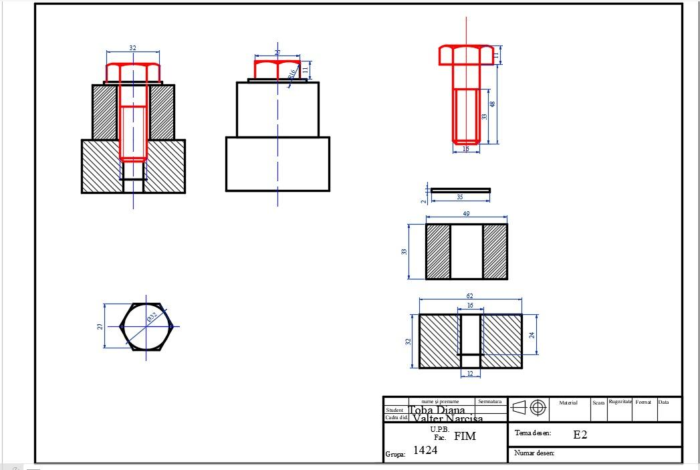
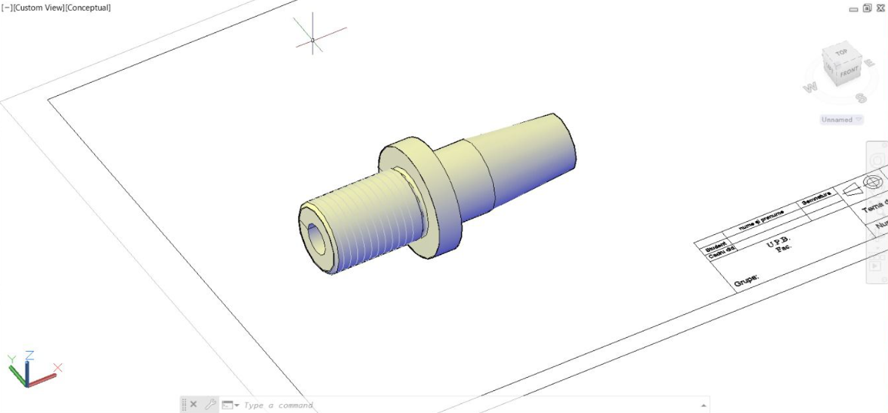

# Threaded Assembly: 2D & 3D Representation

## Project Overview
This project focuses on the **2D and 3D representation of a threaded assembly** using **CAD software**. The aim is to create accurate technical drawings and 3D models of threaded components commonly used in **medical engineering applications**.

## Application in Medical Engineering
Threaded assemblies play a crucial role in **medical devices**, such as:
- **Oxygen reduction systems** in medical equipment.
- **Screw-based implants** used in **orthopedic and dental surgeries**.
- **Fasteners for surgical instruments and medical apparatus**.

## Features
- **2D Technical Drawings**: Standardized technical representation of threaded components.
- **3D Modeling**: Parametric CAD models of screws, nuts, and assembled parts.
- **Exploded Views**: Visualizing the components separately for better understanding.
- **Fastener Material Analysis**: Exploring commonly used **biomaterials** like **titanium and zirconium** for medical applications.

## Tools & Technologies
- **AutoCAD** – for 2D and 3D modeling
- **ISO 6410 Standards** – for technical representation of threaded components

## Goals
- Develop **standardized** technical drawings and 3D representations.
- Improve **understanding of threaded assemblies** used in medical applications.
- Optimize **CAD modeling skills** for mechanical and biomedical engineering.

## Screenshots

